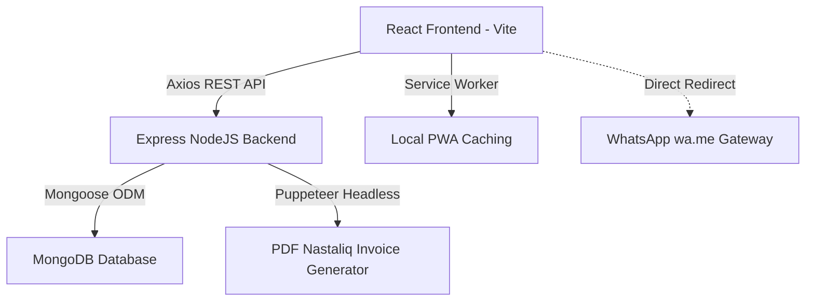

# 🏍️ Naseeb Autos & Showroom — Installment Management ERP
> **Premium Karobar (Business) Management & Recovery Tracker for Electronics, Cars, & Motorcycles.**
> Developed for Naseeb Autos & Showroom, Khuzdar, Balochistan.

---

## 📖 Overview (Khulasa)

**Naseeb Autos & Showroom ERP** ek nihayat premium aur advanced business solution hai jo kistain (installments) par gaariyan (motorcycles, cars) aur electronics farokht karne wale showrooms ke liye banaya gaya hai. 

Yeh system **Bilingual (English + Roman Urdu)** hai taake field managers, owners, aur collectors asani se poore karobar ka hisab rakh sakein. Mobile-first design, interactive reports, custom confirmation dialogs, aur dynamic WhatsApp reminders se lass yeh ERP showroom ki recovery ko 100% transparent aur fast banata hai.

---

## ✨ Core Features (Bandi Karkardagi)

### 1. 📋 Gahak Management (Customer Records)
* **CNIC Constraints (Sparse Unique)**: DB validations ko sparse kiya gaya hai taake blank CNICs par duplicate blocks na ayein.
* **Dynamic Sidebar Profiles**: Gahak ki tasveer, mukammal pata (address), and registered dates ko visual status badges ke sath track karein.

### 2. 🤝 Zamanatdar Wizard (Guarantor Accordions)
* **Step-by-step Wizard**: Naya installment plan kholte waqt **Zamin Awwal (Primary Guarantor)** aur **Zamin Doam (Secondary Guarantor)** ke dynamic collapsible forms.
* Karobar (Business) ya Mulazmat (Job/Department) ke zariye verification fields.

### 3. 💳 FIFO Payment Logic (Qistain Auto-Distribution)
* **Oldest-First Lump-sum Distribution**: Jab gahak ek se zyadah missed qistain ek sath jama karwata hai (bulk payments), toh system chronologically (DueDate ke mutabiq) sabse purani qist ko pehle pay karta hai (FIFO: First-In-First-Out).
* Status automations: `paid` (ada shuda), `partially_paid` (kuch hissa), aur `missed` (late qist).

### 4. 📈 Recovery & Stats Charts
* **Expected vs Actual Analytics**: Showroom owner ko live 6-month trends dikhata hai ke kitni raqam expected thi aur kitni wasool (collected) hui.
* **Status breakdown**: Interactive Recharts pie charts ke zariye active, completed, near completion, aur defaulted khaton ka overview.

### 5. 📱 PWA (Progressive Web App) & Offline Ready
* Mobile-first design jo showroom managers ke mobile screens par native app ki tarah chalta hai.
* Service Workers (`sw.js`) aur custom vector `logo.svg` ke zariye offline startup stability.

### 6. 💬 WhatsApp Reminders
* One-click dynamic Roman Urdu templates jo seedha customer ke WhatsApp par expected amount aur remaining balance send karte hain:
  ```text
  "Assalam o Alaikum {fullName},
  Yeh aapke Naseeb Electronics & Showroom ka payment reminder hai.
  📦 Item: {brand} {model}
  💰 Qist Amount: Rs. {amount}
  💳 Remaining Balance: Rs. {remaining}
  Meherbani farma kar jald payment ada karein. Shukriya 🙏"
  ```

---

## 🛠️ Architecture & Tech Stack (Sahafat)



### Technical Stack:
* **Frontend**: React 18, Vite, Recharts, TailwindCSS, Radix UI, Lucide Icons, React Hook Form.
* **Backend**: Node.js, Express.js, MongoDB (Mongoose), Puppeteer (PDF generator with Noto Nastaliq Urdu render window support).
* **Security**: JWT Authentication, Role-based Route Protection (`owner`, `manager`, `worker`).

---

## 📂 Project Structure (Directory Layout)

```text
├── backend/
│   ├── controllers/      # Payment, customer, and installment transaction controllers
│   ├── models/           # Mongoose schemas (Customer, Installment, User, Payment)
│   ├── routes/           # Role-restricted routes with authorizeRoles middleware
│   ├── utils/            # Puppeteer PDF generation and health metrics
│   └── server.js         # Entrypoint, RSS memory health logs, DB connections
└── frontend/
    ├── public/           # PWA manifest.json, sw.js, brand logo.svg
    ├── src/
    │   ├── components/   # UI elements (PageWrapper, ConfirmModal, Pagination)
    │   ├── pages/        # Dashboard with Recharts, Customers, Installment Wizard
    │   ├── store/        # Zustand state stores
    │   └── main.jsx      # Entrypoint & PWA worker registration
```

---

## 🚀 How to Run & Setup (Chalanay Ka Tareeqa)

### 1. Requirements
* Node.js v18+
* MongoDB local instance ya MongoDB Atlas connection string.

### 2. Environment Variables Setup
* **Backend (`backend/.env`)**:
  ```env
  PORT=5000
  MONGO_URI=mongodb://localhost:27017/naseeb_autos
  JWT_SECRET=your_jwt_secret_token
  NODE_ENV=development
  ```
* **Frontend (`frontend/.env`)**:
  ```env
  VITE_API_URL=http://localhost:5000/api
  ```

### 3. Installation & Run
```bash
# 1. Backend run karein
cd backend
npm install
npm run dev

# 2. Frontend run karein
cd ../frontend
npm install
npm run dev
```
Open `http://localhost:3000` aapke browser mein!

---

## 🛡️ Role-Based Security (Ohday)
Tamam routes ko secure kiya gaya hai:
* **Owner (Malik)**: Sab kuch kar sakta hai (Deletes, edits, transactions, health checks, team management).
* **Manager**: Daily entries, new installments wizard, stock records, reports view.
* **Worker (Collector)**: Sirf daily payments update aur routes view karne ki ijazat hai.

---

> **Naseeb Autos & Showroom ERP** — Visual excellence aur high performance ka behtareen milap. ✨
